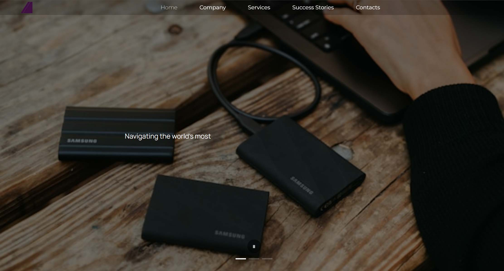

# Multi-Container Presentation System

Interactive presentation with synchronized carousel and typewriter effects

## 🎯 Overview
A JavaScript-based interactive presentation system that synchronizes Swiper.js carousels, Fullpage.js scrolling, and typewriter animations with audio effects.

## 🔗 Demo
Live Demo | GitHub Repository

## 🏗️ Core Architecture
### 1. MultiContainerManager (contentManager.js)
Manages 3 chapters (chapter1, chapter2, chapter3) as Swiper slides

Controls sequential playback with typing animations

Integrates with Swiper.js (slideTo) and Fullpage.js (moveTo)

Provides play/pause/stop controls

### 2. Typewriter Engine (typing.js)
Word-by-word or char-by-char typing animations with configurable speed

Audio preloading system for seamless sound effects

Memory management and task cleanup

Multiple interrupt modes (stop, abort, override)

### 3. Main Controller (index.js)
Initializes all components (Swiper, Fullpage, Manager)

Handles pagination clicks and UI interactions

Manages audio preloading on user interaction

## 🔧 Key Features
Synchronized Playback

javascript
// Swiper slide + Fullpage section + Typewriter animation
manager.playNextContainer() → swiper.slideTo() → typeWriter()
Audio System

Preloads typewriter sounds on first user click

Uses looped audio with volume control

Browser autoplay policy handling

State Management

Tracks current chapter, slide, and item index

Maintains play/pause state across page scrolls

Cleans up DOM and animations between transitions

Responsive Controls

Play/pause button for automatic playback

Swiper pagination for manual chapter navigation

Fullpage scroll for section changes

## 📦 Tech Stack
Core: Vanilla JavaScript (ES6+)

UI Libraries: Swiper.js (carousel), Fullpage.js (scrolling)

Animations: Custom typewriter engine with audio

Dependencies: jQuery (for Fullpage integration)

## 🚀 Quick Start
javascript
### 1. Define content
const contentMap = {
    'chapter1': [{ bk: 'image.jpg', text: 'Your content...' }]
};

### 2. Initialize manager
const manager = MultiContainerManager(containers, contentMap);

### 3. Start playback
const controls = manager.getControlHandle();
controls.togglePlay(); // Start automatic presentation
## 💡 Technical Highlights
Modular Design: Separated concerns (manager, typewriter, controller)

Performance: Audio preloading, DOM cleanup, memory management

UX: Seamless transitions between horizontal (Swiper) and vertical (Fullpage) navigation

Maintainability: Clear state management and event handling
